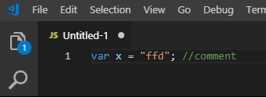

# End-Of-Code



Pressing the 'END' key on this line of code will put your cursor before the comment starts

```js
let x = someVariable; //here's some comment
```

Just before the `//here's some comment`

## Language support

JavaScript/TypeScript, C#, C++, PHP, Ruby, Python, Java, HTML

## Installation

Get it here: https://marketplace.visualstudio.com/items?itemName=Jitbit1.end-of-code
